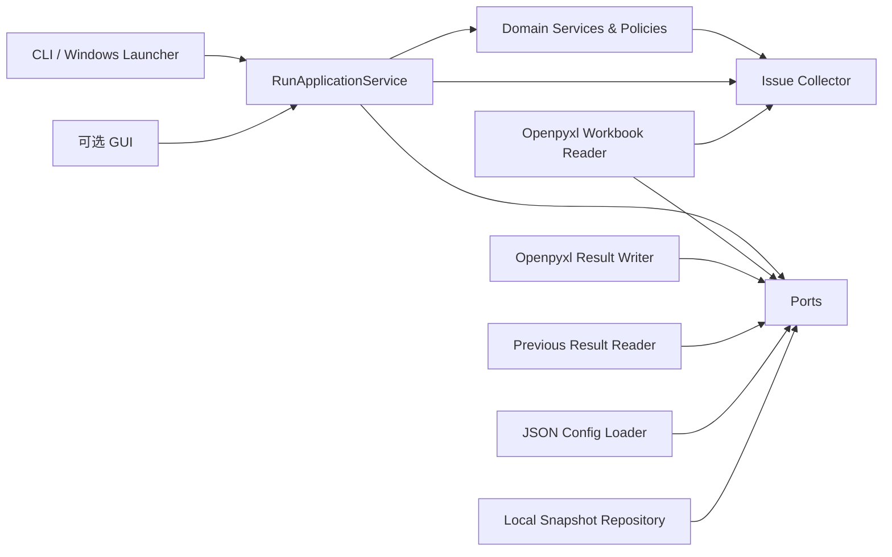
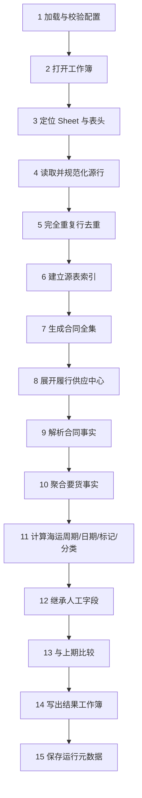

# Excel 到货时间与收入月份工具系统设计

- 文档 ID：`SYSTEM-DESIGN`
- 当前版本：`0.1`
- 状态：`ACTIVE-DRAFT`
- 日期：`2026-08-25`
- 适用仓库：`olu37776-bit/excel-arrival-tool`
- 需求依据：
  - `docs/requirements-baseline.md`
  - `docs/source-schema.md`
  - `docs/output-schema.md`
  - `docs/comparison-output.md`
  - `docs/decisions/DR-001-manual-adjustment-fields.md`

> 本文是后续实现的架构与工程基线。业务口径以需求文档为权威来源；本文负责规定模块边界、依赖方向、数据模型、处理流水线、扩展机制、异常模型、历史比较和验证方式。实现不得为了快速读取 Excel 而把业务规则重新写回列号、Sheet 名、公式或单个大函数中。

## 1. 设计目标

系统读取一个业务 Excel 工作簿中的多个 Sheet，生成一个结果工作簿，完成基表、两套收入年月变化清单和异常清单。

设计必须同时满足：

1. 源表字段名变化时，只修改映射配置；
2. 输出显示名称变化时，只修改输出配置或模板；
3. 业务规则变化时，只修改对应规则模块；
4. 增加新输出字段时，不重写完整处理流水线；
5. 增加 GUI、命令行、批处理或其他入口时，不修改领域规则；
6. 更换 Excel 读取库或增加其他输入格式时，不修改领域规则；
7. 任一合同或字段数据异常不影响其他合同继续处理；
8. 每个结果和异常都能追溯到源 Sheet、源行和规则版本；
9. 多次运行的人工字段继承和收入年月比较不依赖可变列名；
10. 代码、测试、配置和输出都只使用正式日期术语 `RPD`。

## 2. 当前非目标

当前版本不建设：

- 收入金额汇总或正式收入统计报表；
- 装运排程、运输优化或资源规划；
- 数据库服务或多人在线系统；
- 复杂权限系统；
- 在 Excel 中保留 VLOOKUP 等计算公式；
- 把真实业务数据、运行结果或历史快照提交到公共仓库。

## 3. 技术方案

### 3.1 语言与运行平台

第一版采用：

- `Python 3.11+`
- Windows 本地运行
- `openpyxl` 作为 `.xlsx/.xlsm` 输入输出适配器
- Python 标准库完成领域计算、分组、索引、日期和 JSON 配置处理
- `pytest` 作为测试框架
- 可选使用 `PyInstaller` 打包为 Windows 可执行程序

第一版不把 `pandas` 作为领域层依赖。若本地资料证明数据规模需要 DataFrame 或流式处理，可新增实现同一端口的读取/处理适配器，领域规则和应用用例不得变化。

`.xls` 不属于第一版默认支持格式。若实际资料存在 `.xls`，新增 `XlsWorkbookReader` 适配器，不修改业务核心。

### 3.2 交互方式

第一版提供：

- 命令行入口；
- Windows 批处理启动脚本；
- 可选的简易文件选择界面作为后续入口适配器。

核心应用只接收统一的 `RunRequest`，不感知调用来自命令行、GUI 或测试。

建议命令：

```text
excel-arrival-tool run \
  --input 本期业务工作簿.xlsx \
  --output 本期结果.xlsx \
  --previous 上期结果.xlsx \
  --config config/local.json
```

`--previous` 可选；缺失时视为首次运行。

## 4. 总体架构

采用端口与适配器风格，并保持单向依赖。



### 4.1 依赖方向

依赖只能朝向内部：

```text
entrypoints → application → domain
adapters → ports/domain contracts
```

禁止：

- `domain` 导入 `openpyxl`；
- 业务规则读取 Excel 列字母；
- Excel 写出层重新计算业务字段；
- CLI 直接拼装基表数据；
- 配置文件承载散乱的程序控制流程；
- 单元测试通过 Excel 文件才能验证纯业务规则。

### 4.2 各层职责

| 层 | 职责 | 不负责 |
|---|---|---|
| `entrypoints` | 参数、文件选择、用户提示、退出码 | 业务计算 |
| `application` | 用例编排、阶段顺序、事务边界、结果汇总 | Excel 单元格解析细节、业务公式 |
| `domain` | 业务模型、优先级、聚合、海运周期、到货日期、分类、比较 | 文件系统、Sheet、列号、样式 |
| `ports` | 定义输入、输出、历史、配置等抽象接口 | 具体库实现 |
| `adapters` | openpyxl、JSON、文件系统等外部实现 | 决定业务口径 |
| `observability` | 异常、运行清单、追溯信息 | 修改业务结果 |

## 5. 建议仓库结构

```text
excel-arrival-tool/
├─ docs/
│  ├─ requirements-baseline.md
│  ├─ source-schema.md
│  ├─ output-schema.md
│  ├─ comparison-output.md
│  ├─ system-design.md
│  ├─ decisions/
│  └─ reviews/
│
├─ config/
│  ├─ default/
│  │  ├─ source-mapping.json
│  │  ├─ output-layout.json
│  │  └─ runtime.json
│  └─ local.example.json
│
├─ src/excel_arrival_tool/
│  ├─ entrypoints/
│  │  ├─ cli.py
│  │  └─ windows_launcher.py
│  │
│  ├─ application/
│  │  ├─ run_request.py
│  │  ├─ run_result.py
│  │  ├─ run_service.py
│  │  └─ pipeline_stages.py
│  │
│  ├─ domain/
│  │  ├─ models.py
│  │  ├─ value_objects.py
│  │  ├─ issues.py
│  │  ├─ ruleset.py
│  │  ├─ contract_resolution.py
│  │  ├─ demand_aggregation.py
│  │  ├─ transit_policy.py
│  │  ├─ arrival_policy.py
│  │  ├─ revenue_segment_policy.py
│  │  ├─ manual_inheritance.py
│  │  └─ comparison.py
│  │
│  ├─ ports/
│  │  ├─ workbook_reader.py
│  │  ├─ result_writer.py
│  │  ├─ previous_result_reader.py
│  │  ├─ snapshot_repository.py
│  │  └─ config_provider.py
│  │
│  ├─ adapters/
│  │  ├─ excel/
│  │  │  ├─ workbook_reader.py
│  │  │  ├─ sheet_locator.py
│  │  │  ├─ header_resolver.py
│  │  │  ├─ row_parser.py
│  │  │  ├─ previous_result_reader.py
│  │  │  └─ result_writer.py
│  │  ├─ config/
│  │  │  ├─ json_loader.py
│  │  │  └─ config_validator.py
│  │  └─ filesystem/
│  │     └─ snapshot_repository.py
│  │
│  └─ bootstrap.py
│
├─ tests/
│  ├─ unit/
│  ├─ contract/
│  ├─ integration/
│  ├─ fixtures/
│  └─ golden/
│
├─ pyproject.toml
├─ run_tool.bat
└─ README.md
```

模块名可在实施时小幅调整，但职责边界和依赖方向不得改变。

## 6. 稳定内部语义

### 6.1 Sheet 业务角色

内部只使用业务角色，不使用用户工作簿中的显示名称：

```text
legacy              遗留量
monthly_order       当月订货，可选
 demand_detail      要货明细
transit_spec        国家运输周期
```

实际 Sheet 名、别名、期望顺序和表头行由映射配置定义。

### 6.2 核心字段 ID

核心规则只使用稳定内部字段 ID，例如：

```text
contract_no
legacy_amount
monthly_new_order
bg
region
country
carryover_type
customer_group
project_name
incoterm
supply_center
stock_control_flag
shipment_control_flag
ata
asd
rpd
cpd
transit_days
arrival_date_rpd
arrival_date_cpd
revenue_month_rpd
revenue_month_cpd
revenue_segment
manual_adjust_flag
manual_revenue_month
adjustment_note
```

任何源表头或输出标题的变化都不改变这些 ID。

## 7. 核心领域模型

### 7.1 业务键

```python
@dataclass(frozen=True, order=True)
class BusinessKey:
    contract_no: str
    supply_center: str
```

所有基表行、人工字段继承、历史比较和异常定位都使用该键。

### 7.2 来源追溯

```python
@dataclass(frozen=True)
class SourceRef:
    workbook_name: str
    sheet_role: str
    sheet_name: str
    row_number: int | None
    column_header: str | None
```

每条规范化记录保留 `SourceRef`。异常清单不得只写“数据错误”，必须能定位来源。

### 7.3 原始与规范化记录

建议模型：

```text
RawWorkbook
RawSheet
RawRow
NormalizedLegacyRow
NormalizedMonthlyOrderRow
NormalizedDemandRow
NormalizedTransitSpecRow
```

`RawRow` 保留原始行顺序和完整单元格值；规范化记录只暴露内部字段 ID。

### 7.4 合同事实

```text
ContractFacts
- contract_no
- legacy_amount
- monthly_new_order
- bg
- region
- country
- customer_group
- project_name
- carryover_type
- provenance_by_field
```

合同事实由遗留量、可选当月订货和要货明细按需求优先级解析。

### 7.5 要货分组事实

```text
DemandGroupFacts
- key: BusinessKey
- real_rows
- incoterm
- stock_control_values
- shipment_control_values
- ata_max
- asd_max
- rpd_min
- cpd_max
- distinct_rpd_count
- distinct_cpd_count
- duplicate_count
- provenance
```

完全重复行在构建该对象前去除，但重复异常仍保留。

### 7.6 基表记录

```text
BaseRecord
- key
- 29 个输出字段对应的内部值
- source/provenance 摘要
- calculation_status
```

`BaseRecord` 不包含 Excel 列号、样式或公式。

### 7.7 异常

```python
@dataclass(frozen=True)
class Issue:
    code: str
    severity: str
    stage: str
    message: str
    source: SourceRef | None
    contract_no: str | None
    supply_center: str | None
    field_id: str | None
    raw_value: object | None
    resolution: str
```

### 7.8 变化记录

```text
ComparisonRecord
- key
- comparison_type: RPD | CPD
- previous_month
- current_month
- direction: 提前 | 延后 | 新增 | 取消
- month_delta
- current_or_previous_contract_attributes
```

## 8. 配置设计

### 8.1 配置与代码边界

放入配置：

- Sheet 名、别名、期望顺序、表头行；
- 各 Sheet 的源字段 canonical name 和 aliases；
- 输出 Sheet 名；
- 输出列顺序、显示标题、日期格式、列宽；
- 多值拼接分隔符；
- 本地历史目录、默认输出目录；
- 技术运行参数。

保留在代码规则层：

- 合同全集生成；
- 来源优先级；
- 完全重复去重语义；
- 第一条取值与冲突异常；
- 多个供应中心、分批发货、多次要货、分批供应；
- 结转国家集合；
- `FCA/FOB/EXW → 5 天`；
- ATA/ASD/RPD/CPD 聚合；
- 两套到货日期；
- 收入分段类别；
- 人工字段继承；
- 跨月变化规则。

业务规则必须集中在独立策略类中，不能散落在应用编排和 Excel 适配器中。

### 8.2 默认配置与本地覆盖

建议：

```text
config/default/*.json       提交仓库的默认契约
config/local.json           用户本地覆盖，不提交仓库
```

加载顺序：

```text
默认配置 → 本地覆盖 → 配置校验 → 不可变 RuntimeConfig
```

本地覆盖只能改变映射和显示，不得通过配置绕过已确认业务规则。

### 8.3 Sheet 定位

定位顺序：

1. Sheet 名 canonical/alias 精确匹配；
2. 唯一包含匹配；
3. 名称未命中时，可结合期望顺序和字段指纹推断；
4. 推断必须唯一，否则记录 `AMBIGUOUS_SHEET_ROLE`；
5. 当月订货角色未找到视为正常可选缺失；
6. 其他角色未找到记录异常并继续可计算部分。

Sheet 顺序用于验证和兜底，不作为唯一识别依据。

### 8.4 字段定位

所有字段统一使用：

```text
规范化 → canonical/alias 精确匹配 → 唯一包含匹配
```

多个包含候选时：

- 记录 `AMBIGUOUS_FIELD`；
- 该字段本次不可用；
- 依赖字段按空值/异常路径处理；
- 不选择第一个候选。

## 9. 处理流水线

`RunApplicationService` 固定按以下阶段运行。每阶段只接受上一阶段的规范化产物，不直接跨层访问 Excel。



### 9.1 加载配置

- 校验 JSON 结构和版本；
- 构建不可变 `RuntimeConfig`；
- 生成 `ruleset_version`、`mapping_version`、`output_schema_version`；
- 配置不可用属于技术失败，不进入业务计算。

### 9.2 打开工作簿

- 只打开用户指定的一份本期业务工作簿；
- 输入适配器返回工作簿元数据，不暴露 openpyxl 对象给领域层；
- 工作簿损坏或无法打开属于技术失败；
- 公式字段使用缓存结果，公式存在但没有可用缓存值时记录 `FORMULA_VALUE_UNAVAILABLE`。

### 9.3 定位 Sheet 与表头

- 按业务角色定位；
- 记录实际 Sheet 名和识别方式；
- 解析每个内部字段 ID 对应的实际列；
- 生成 `ResolvedSheetSchema`；
- 字段缺失或歧义写异常，但不终止整批。

### 9.4 读取和类型规范化

- 合同号始终按文本处理并保留前导零；
- 金额解析为 `Decimal | None`；
- 日期解析为 `date | None`；
- Y/N 去空白、转大写，非法值记录异常；
- 运输周期解析为非负整数；
- 文本只做有限规范化，不删除有业务意义的字符。

### 9.5 完全重复行去重

每个 Sheet 独立处理：

1. 基于整行有效单元格的规范化值生成指纹；
2. 第一条保留；
3. 后续完全相同指纹的行记录 `DUPLICATE_ROW_IGNORED`；
4. 被忽略行不参与任何记录数、日期数或分批判断；
5. 保留重复来源行号，便于异常解释。

不得仅按合同号或少数字段去重，否则会删除真实业务明细。

### 9.6 建立索引

建议构建：

```text
legacy_by_contract
monthly_order_by_contract
 demand_rows_by_contract
 demand_rows_by_business_key
transit_specs_by_country_and_center
```

所有索引保持源表原始顺序，满足“默认取第一条”的规则。

### 9.7 生成合同全集

```text
遗留量合同号
∪ 可选当月订货合同号
∪ 要货明细合同号
```

排除空合同号；空合同号记录异常。

合同排序必须确定性，建议按规范化合同号升序；如业务要求保留首次出现顺序，可通过单独的排序策略替换，不影响其他模块。

### 9.8 展开履行供应中心

每个合同从去重后的要货明细取得不同有效履行供应中心：

- 一个中心生成一行；
- 多个中心生成多行；
- 没有中心时记录 `MISSING_SUPPLY_CENTER`，不生成空中心业务行；
- 其他合同继续。

### 9.9 解析合同事实

统一使用 `ContractFactsResolver`：

- 完全重复已经去除；
- 同合同多行按原顺序取第一条；
- 后续不同非空值记录 `CONFLICTING_CONTRACT_VALUE`；
- 来源优先级为空时继续下一来源；
- 输出值保留来源信息。

不要为 29 个输出字段分别写散乱查询代码。

### 9.10 聚合要货事实

每个 `BusinessKey` 使用 `DemandGroupAggregator`：

- 保留真实明细顺序；
- `ATA = MAX`；
- `ASD = MAX`；
- `RPD = MIN`；
- `CPD = MAX`；
- 统计不同有效 RPD/CPD 日期数；
- 收集备货和发货总控值；
- 检查贸易术语和文本属性冲突；
- 完全重复行不进入该组。

### 9.11 业务计算

按固定依赖图计算，禁止循环依赖：

```text
合同事实 + 要货组事实
  ├─ 多个供应中心发货
  ├─ 分批发货
  ├─ 多次要货
  ├─ 分批供应
  ├─ 是否解锁备货显示
  ├─ 海运周期
  ├─ 到货日期（按RPD）
  ├─ 到货日期（按CPD）
  ├─ 收入年月（按RPD）
  ├─ 收入年月（按CPD）
  └─ 收入分段类别
```

每个策略返回“值 + 产生的异常”，不直接写全局文件或修改 Excel。

### 9.12 人工字段继承

`PreviousResultReader` 按 `BusinessKey` 读取上一期：

- 是否手工调整收入月份；
- 手工调整收入月份；
- 调整备注。

规则：

- 首次运行为空；
- 新业务键为空；
- 已存在业务键继承；
- 不按行号继承；
- 不用输出显示标题作为唯一身份；
- 继承失败写异常但不影响自动字段。

### 9.13 跨期比较

分别调用同一通用比较器：

```text
RPD 比较字段：revenue_month_rpd
CPD 比较字段：revenue_month_cpd
```

比较结果：

- 相同：不输出；
- 本期晚：延后；
- 本期早：提前；
- 上期空、本期有：新增；
- 上期有、本期空：取消；
- 两期空：不输出。

两期都有年月时计算绝对月份差；新增和取消的变化月数为空。

### 9.14 写出结果

写出层只负责投影和格式，不重新计算：

- 按 `output-layout.json` 顺序写 29 列；
- 写 RPD 跨月变化；
- 写 CPD 跨月变化；
- 写异常清单；
- 设置筛选、冻结首行、日期格式、列宽；
- 所有输出排序确定性。

## 10. 业务策略设计

### 10.1 海运周期策略

```python
class TransitPolicy(Protocol):
    def resolve(self, context: TransitContext) -> RuleResult[int | None]: ...
```

默认实现：

```text
规范化贸易术语属于 FCA/FOB/EXW → 5
否则 → 国家+履行供应中心查规格
```

未来增加其他特殊贸易类型时，新增策略分支或装饰器，不修改 Excel Reader 和到货日期策略。

### 10.2 到货日期策略

RPD 和 CPD 使用两个独立但共享公共函数的策略，避免一个超长条件分支：

```text
ArrivalDateByRpdPolicy
ArrivalDateByCpdPolicy
```

两者共享 ATA/ASD 优先逻辑，但分别依赖 RPD 最小值或 CPD 最大值。

### 10.3 收入分段策略

`RevenueSegmentPolicy` 只依赖：

- multiple_demand
- ata
- asd
- rpd
- cpd

不依赖 Excel、海运周期、到货日期和人工调整字段。

### 10.4 字段来源策略

通用 `PriorityValueResolver` 接受明确来源列表：

```text
bg: legacy → monthly_order → demand_detail
region: legacy → demand_detail
country: legacy → demand_detail
customer_group: legacy → demand_detail
project_name: legacy → demand_detail
```

它负责：

- 跳过空值；
- 返回第一个有效值；
- 保留来源；
- 报告选中来源内部冲突；
- 不把来源优先级硬编码在 Excel 适配器中。

## 11. 异常模型

### 11.1 等级

| 等级 | 含义 | 行为 |
|---|---|---|
| `FATAL_TECHNICAL` | 工作簿无法打开、输出无法保存、配置无法解析 | 本次运行失败 |
| `DATA_ERROR` | 某字段或某行无法可靠计算 | 写异常；依赖字段留空；继续其他数据 |
| `WARNING` | 冲突、重复、推断、非关键异常 | 写异常；按已确认兜底规则继续 |
| `INFO` | 可解释的运行事件 | 可选写入运行信息，不必进入业务异常清单 |

除 `FATAL_TECHNICAL` 外均不得终止整批。

### 11.2 建议错误码

```text
WORKBOOK_OPEN_FAILED
WORKBOOK_SAVE_FAILED
CONFIG_INVALID
MISSING_SHEET_ROLE
AMBIGUOUS_SHEET_ROLE
MISSING_FIELD
AMBIGUOUS_FIELD
INVALID_CONTRACT_NO
INVALID_NUMBER
INVALID_DATE
INVALID_ENUM_VALUE
INVALID_TRANSIT_DAYS
DUPLICATE_ROW_IGNORED
CONFLICTING_CONTRACT_VALUE
CONFLICTING_DEMAND_VALUE
CONFLICTING_TRANSIT_SPEC
MISSING_SUPPLY_CENTER
MISSING_TRANSIT_SPEC
MISSING_ARRIVAL_INPUT
STOCK_SHIPMENT_FLAG_MISMATCH
PREVIOUS_RESULT_UNREADABLE
MANUAL_FIELD_INHERITANCE_FAILED
```

### 11.3 异常清单列

建议固定为：

1. 严重级别
2. 错误码
3. 处理阶段
4. 合同号
5. 履行供应中心
6. Sheet
7. 行号
8. 字段
9. 原始值
10. 原因
11. 处理结果

异常按严重级别、Sheet 顺序、行号、错误码稳定排序。

## 12. 输出工作簿设计

### 12.1 可见 Sheet

1. `基表`
2. `RPD跨月变化`
3. `CPD跨月变化`
4. `异常清单`

### 12.2 隐藏系统 Sheet

建议增加两个 veryHidden Sheet，以支持可靠继承和版本迁移：

#### `_meta`

保存：

- run_id
- generated_at
- tool_version
- ruleset_version
- mapping_version
- output_schema_version
- input_file_name
- input_file_hash
- previous_file_name
- 内部字段 ID 与基表列位置映射

#### `_snapshot`

保存本次基表的自动规范字段，列名使用内部字段 ID，而不是用户显示标题。

用途：

- 下次比较自动收入年月；
- 输出标题改变后仍能读取历史；
- 验证上一期规则版本；
- 不受用户调整列宽、排序和显示名称影响。

人工字段仍从可见基表按 `BusinessKey` 读取，因为用户可能在生成后修改它们。

如果上一期文件没有隐藏系统 Sheet，适配器可退化为从可见基表按字段映射读取，并记录兼容模式告警。

## 13. 历史与快照

定义两个独立端口：

```text
PreviousResultReaderPort
RunSnapshotRepositoryPort
```

- `PreviousResultReaderPort`：读取用户指定的上一期结果，支持人工字段继承和变化比较；
- `RunSnapshotRepositoryPort`：可选地在本地保存不可变运行快照，用于审计和问题复现。

真实快照只能保存在本地忽略目录，例如：

```text
.local-data/history/
```

不得提交公共仓库。

## 14. 可扩展性场景

### 14.1 源字段改名

只更新 `source-mapping.json` 的 canonical/alias；业务规则不变。

### 14.2 输出字段改名或换顺序

只更新 `output-layout.json`；内部字段 ID 和领域模型不变。

### 14.3 增加一个来源回退

只修改对应 `PriorityValueResolver` 的来源声明和测试，不修改 Excel 写出。

### 14.4 增加新的特殊贸易术语

只修改 `TransitPolicy`，并新增对应规则测试。

### 14.5 增加新的输出字段

1. 定义内部字段 ID；
2. 在领域模型或输出投影中提供值；
3. 增加独立规则；
4. 在输出配置中加入列；
5. 添加测试；
6. 不修改不相关规则。

### 14.6 增加新的变化清单

复用通用 `MonthComparisonService`，只配置比较字段、Sheet 标题和投影列。

### 14.7 增加 GUI

GUI 只构造 `RunRequest` 并展示 `RunResult`；不直接读取 Excel 和计算业务字段。

### 14.8 支持其他文件格式

新增实现 `WorkbookReaderPort` 的适配器，核心领域不变。

## 15. 测试设计

### 15.1 单元测试

纯领域测试，不读取 Excel：

- 合同三表并集；
- 第一条取值与冲突异常；
- 完全重复不计分批；
- 来源优先级；
- 多个供应中心；
- 分批发货；
- 多次要货；
- 分批供应；
- 结转类型；
- 特殊贸易术语 5 天；
- 国家+中心运输周期；
- ATA/ASD/RPD/CPD 聚合；
- 两套到货日期；
- 收入分段类别；
- 三个人工字段继承；
- 提前、延后、新增、取消比较。

测试名应引用需求规则 ID，例如：

```text
test_BR_TRANSIT_001_fca_returns_five_days
test_BR_ARRIVAL_RPD_001_uses_ata_without_transit
test_BR_SPLIT_SHIPMENT_001_ignores_exact_duplicate_rows
```

### 15.2 契约测试

验证适配器：

- Sheet exact/contains 定位；
- 字段 exact/contains 唯一命中；
- 歧义字段；
- 日期、金额、Y/N、运输周期解析；
- 前导零合同号；
- 可选当月订货缺失；
- 公式缓存缺失。

### 15.3 集成测试

使用完全虚构工作簿验证：

```text
输入工作簿 → 处理流水线 → 输出工作簿
```

至少覆盖：

- 单供应中心；
- 多供应中心；
- 缺当月订货；
- 冲突值；
- 重复脏数据；
- 特殊贸易术语；
- 运输周期缺失；
- 日期非法；
- 首次运行；
- 后续人工字段继承；
- RPD/CPD 四种变化方向。

### 15.4 Golden 测试

保留脱敏/虚构的期望输出数据结构，不依赖 Excel 二进制文件的无关元数据。比较：

- Sheet 名；
- 表头；
- 单元格业务值；
- 日期格式；
- 异常码；
- 排序。

### 15.5 验证门禁

进入业务试用前至少满足：

- 领域规则单元测试全部通过；
- 输入输出契约测试全部通过；
- 端到端虚构样例通过；
- 本地真实资料审计的字段差异已处理；
- 29 列基表顺序一致；
- 变化清单和异常清单格式一致；
- 代码中不存在 Excel 固定列字母驱动业务的实现；
- 代码中不存在错误日期术语。

## 16. 性能与资源

第一版按典型办公 Excel 规模设计：

- 单工作簿；
- 数千至数万行；
- 一次性本地处理。

优化原则：

- 单次读取每个 Sheet；
- 使用字典索引避免逐行嵌套查询；
- 先去重再分组；
- 不使用单元格级反复随机访问；
- 写出时批量追加行；
- 记录每阶段耗时和行数。

若真实资料超过当前内存或时间目标，优先替换输入/索引适配器，不改领域规则。

## 17. 安全与公开仓库边界

`.gitignore` 必须排除：

```text
*.xlsx
*.xls
*.xlsm
.local-data/
input/
output/
history/
snapshots/
config/local.json
```

公共仓库只允许：

- 代码；
- 默认/示例配置；
- 需求与设计文档；
- 虚构测试数据；
- 构建脚本。

异常日志、截图和测试失败输出不得包含真实合同号、金额、客户、项目或国家业务组合。

## 18. 实施阶段

### 阶段 0：本地事实核对

- 确认真实 Sheet 名、表头行、字段匹配结果；
- 确认数据规模、公式、隐藏列和重复情况；
- 将差异更新到需求和映射配置。

### 阶段 1：工程骨架

- 建立包结构和依赖方向；
- 定义领域模型、端口、配置模型、Issue 模型；
- 建立测试框架；
- 不实现 Excel 业务大循环。

### 阶段 2：输入适配

- Sheet 定位；
- 表头解析；
- 类型规范化；
- 完全重复识别；
- 源记录和异常输出契约测试。

### 阶段 3：领域规则

- 合同全集和供应中心展开；
- 合同事实解析；
- 要货聚合；
- 海运周期；
- 日期与收入月份；
- 派生标记和分类。

### 阶段 4：历史与输出

- 人工字段继承；
- RPD/CPD 变化比较；
- 四个可见 Sheet；
- 隐藏元数据和规范快照；
- 样式和排序。

### 阶段 5：运行入口与打包

- CLI；
- Windows 启动脚本；
- 可选 PyInstaller 构建；
- 使用说明。

### 阶段 6：真实样例验收

- 使用本地真实资料运行；
- 对照人工结果抽样验算；
- 关闭差异；
- 冻结 V1 规则和版本。

## 19. 完成定义

V1 只有在以下条件同时满足时才可标记完成：

1. 需求、设计、配置、代码和测试使用同一内部字段 ID；
2. 29 列基表完整生成；
3. RPD/CPD 两套到货日期和收入年月正确；
4. 四个结果 Sheet 正确；
5. 所有可恢复异常非阻塞并可追溯；
6. 完全重复不会制造分批、多次要货或分批供应；
7. 当月订货缺失仍能正常运行；
8. 人工字段能按业务键继承；
9. 输出标题改变不破坏历史读取；
10. 本地真实样例验收通过；
11. 公共仓库不包含真实业务数据；
12. 不存在绕过架构边界的临时大脚本作为正式入口。

## 20. 设计决策摘要

| 决策 | 选择 |
|---|---|
| 架构 | 端口与适配器 + 纯领域核心 |
| 第一版语言 | Python 3.11+ |
| Excel 实现 | openpyxl 适配器 |
| 领域数据结构 | dataclass/value object + 字典索引 |
| 配置 | JSON 默认配置 + 本地覆盖 |
| 字段匹配 | exact 优先，唯一 contains 兜底 |
| 业务异常 | 写异常清单，局部留空，整批继续 |
| 技术故障 | 无法打开/保存/解析配置时运行失败 |
| 历史键 | 合同号 + 履行供应中心 |
| 业务规则位置 | 独立领域策略类 |
| 输出 | 4 个可见 Sheet + 隐藏元数据/快照 |
| 初始入口 | CLI/Windows 脚本，GUI 可后加 |
| 真实数据 | 仅本地，不进入公共仓库 |

## 21. 变更记录

### 0.1 - 2026-08-25

- 基于当前需求基线建立完整实施架构；
- 确认三层字段解耦、端口与适配器、纯领域规则和非阻塞异常模型；
- 定义规范数据模型、十五阶段处理流水线、历史继承和跨月比较；
- 定义四个可见 Sheet、隐藏元数据/快照、测试体系和分阶段实施计划；
- 明确后续实现必须以本文边界为准，不恢复旧 POC 计算链。